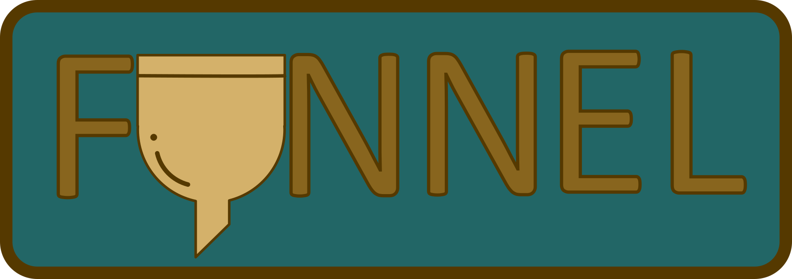
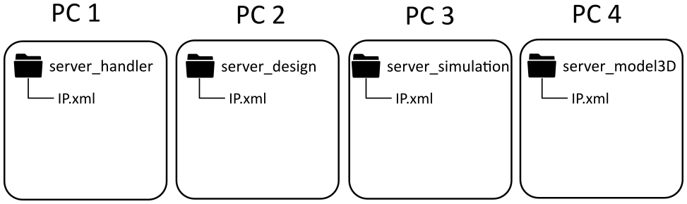
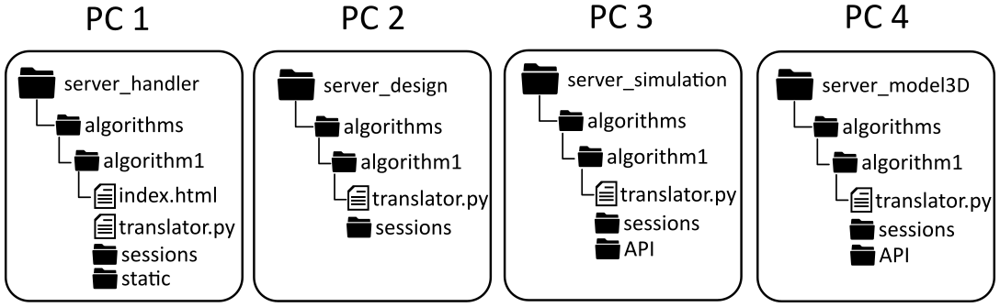
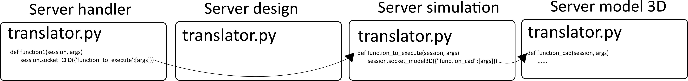

# Funnel
> Server-based platform for an optimized design.

Funnel is a server-based platform, implemented in python, which allows the use
of different tools over one design.

# Table of contents
- [Installing / Getting started](#installing-getting-started)
- [Examples](#examples)
- [Links](#links)
- [Licensing](#licensing)

# Installing / Getting started

Funnel is a server-based platform that allows the easy and fast
implementation of algorithms using the different external software. It uses Python and the web.
Through servers implemented in python connecting with WebSocket and the web, Funnel allows the interaction of software implemented
in a different operatives system and installed on different computers.

Actually, Funnel is composed of four servers: Handler, Design, Simulation and Model 3D. Handler manages the users, its sessions and serves the web page. Design manages the design algorithm and receives the results
of the numeric simulation to improve the initial design. Simulation manages the numeric Simulation (fluid simulations with OpenFOAM), parse
the results and sends it to server Design. Model 3D builds the CAD model (actually through Catia) and serve it to download
from the web page.

To install Funnel, copy each folder inside src (server_handler, server_simulation, server_model3D and server_design) to 
each wanted computer. Then set the IP's pointing to each computer in "IP.xml". Can be set more than one server on the 
same computer.



To run the environment run "server.py" on each computer,
````shell
python server.py
````

To access, set the Handler's IP on the browser, then introduce user and password. To register an user execute "add_user.py" from console,
````shell
python add_user.py user password
````
The next interface is to choose the algorithm. An algorithm is the design algorithm programmed. Contains all the logic. 

In the image below can be seen the minimum files and directories that the algorithm need to work.


##### Files and directories in the algorithm

- Server Handler
    - index.html: file containing the html code for the web, which will be used like GUI.
    - translator.py : python file containing the functions that can be called from another server.
    - sessions : a directory where the session's files will be saved (Cad models in Model 3D or simulations files in Simulation)
    - static: a directory containing all the static files that "index.html" needs to work (JavaScript, CSS, images ...)
- Server Design
    - translator.py : python file containing the functions that can be called from another server.
    - sessions : a directory where the session's files will be saved (Cad models in Model 3D or simulations files in Simulation)
    
- Server Simulation
    - translator.py : python file containing the functions that can be called from another server.
    - sessions : a directory where the session's files will be saved (Cad models in Model 3D or simulations files in Simulation)
    - API : a directory containing homemade API to control external software (ROF, Ravioli implementation for OpenFOAM).

- Server Model 3D
    - translator.py : python file containing the functions that can be called from another server.
    - sessions : a directory where the session's files will be saved (Cad models in Model 3D or simulations files in Simulation)
    - API : a directory containing homemade API to control external software (RICE, Ravioli Implementation Catia Environment).
 
##### How it works?

The functions are written in "translator.py" files are the allowed to be called from another server. This functions 
always have two inputs: session and args. Session is the object which has the methods to communicate with other servers.
 Args are the arguments that the server sent. Let's go with an example of the communication.



Using the different methods of session a function could be executed with its argument
in another server.

# Examples

TO-DO

# Links

- Project homepage: https://github.com/robertpardillo/Funnel
- Issue tracker: https://github.com/robertpardillo/Funnel/issues
- Related projects:
  - Rice: https://github.com/robertpardillo/rice
  - Rof: https://github.com/robertpardillo/rof

# Licensing
The code in this project is licensed under MIT license.